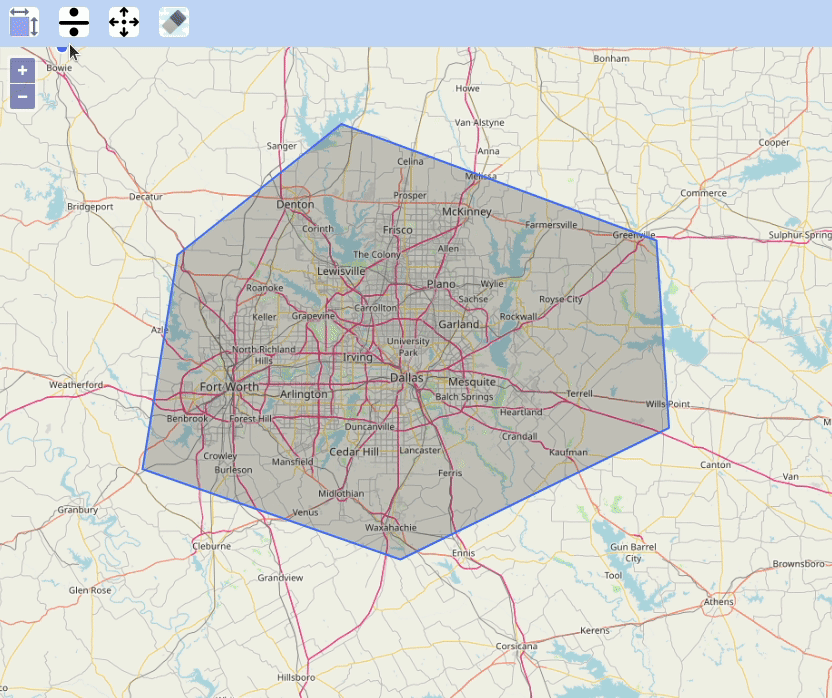

# OpenLayersPolygonSplit
Split a polygon geometry by a line in OpenLayers

## For tutorial post, click on following link 
[Split a Polygon by Line in OpenLayers](https://spatial-dev.guru/2021/09/05/split-a-polygon-by-line-in-openlayers/ "")
